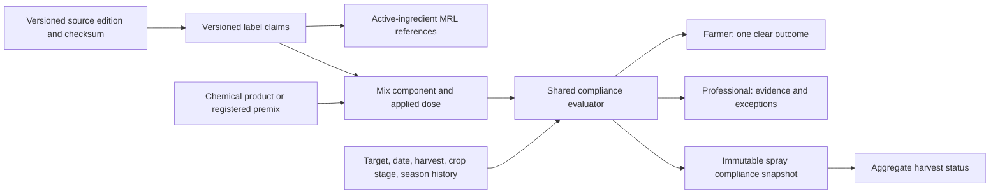

# feat: Add versioned grape spray compliance

## Overview

Extend the existing chemical catalog and PHI workflow so the ICAR-NRCG Annexure 5 grape guidance can drive reliable farmer warnings and consultant review without replacing `chemical_mixes`, `chemical_mix_components`, or existing spray-history fields. The work adds versioned label claims, makes compliance evaluation target- and stage-aware, preserves the exact rule used on each spray record, and exposes different levels of detail to farmers and professionals.

This is compliance decision support, not an automatic pesticide prescription system. A verified rule means the application was evaluated against the recorded Annexure constraints; it does not guarantee residue-test or EU-MRL compliance.

## Problem Frame

The app currently models products, mixes, component doses, product-level PHI rules, target harvest dates, and PHI snapshots. It can calculate the latest safe spray date and earliest safe harvest date. Annexure 5 adds constraints that the current `product + crop` PHI model cannot represent safely: target problem, formulation-level label claim, application count and interval, crop-stage restrictions, resistance warnings, EU MRL references, source revision, and special exceptions.

The current aggregate harvest calculation also ignores records without a valid `safe_harvest_date`. A season containing one verified spray and one unmapped spray can therefore appear safe even though compliance is incomplete.

## Requirements Trace

- **R1. Preserve the existing catalog:** Retain `chemical_products`, `chemical_product_compositions`, `chemical_mixes`, and `chemical_mix_components`; add compatible, nullable relationships rather than replacing live identifiers.
- **R2. Represent the source faithfully:** Store versioned grape label claims by formulation, crop, target problem, PHI, systemic classification, application limits, interval, stage restrictions, resistance groups, advisory notes, and source provenance.
- **R3. Represent MRLs without implying residue prediction:** Store market-specific MRL references per active ingredient and show them only as consultant/audit evidence.
- **R4. Evaluate the complete application context:** Use the selected claim, spray date, target harvest date, pruning/crop stage, and prior season applications to return `allowed`, `warning`, `blocked`, or `unverified` with reasons.
- **R5. Preserve historical truth:** Snapshot claim revision, PHI, restrictions, evaluation result, and relevant source metadata on every new catalog spray record; later catalog updates must not rewrite old decisions.
- **R6. Fail closed in harvest summaries:** Any relevant unmapped or unverified spray makes aggregate compliance `unverified`; it must not be silently omitted from a safe-harvest result.
- **R7. Keep farmer UX simple:** Farmers choose a problem and formulation, receive dose/tank guidance and one clear outcome, and can inspect concise reasons without seeing an expert compliance table by default.
- **R8. Give professionals evidence and season context:** The professional farm workspace shows application history, unresolved records, PHI blockers, application-count/interval warnings, stage restrictions, resistance-family repetition, and source details.
- **R9. Preserve farmer/professional write parity:** Direct farmer saves and delegated professional saves must persist identical compliance fields and apply identical server-side validation.
- **R10. Support annual source updates:** New Annexure revisions are additive and reviewable; superseded claims become inactive/effective-dated instead of being overwritten or deleted.

## Scope Boundaries

- No automatic diagnosis or chemical selection from symptoms, weather, images, or AI output.
- No claim that PHI compliance guarantees EU-MRL compliance or export acceptance.
- No residue-decay prediction.
- No destructive rewrite of existing `chemical_phi_rules` or historical `spray_records` in the first release.
- No blocking of legacy free-text spray logging for all users in the initial rollout; legacy entries remain explicitly unverified.
- No fertilizer-plan schema changes. Spray compliance is a separate workflow even when the same consultant uses both surfaces.
- The first source edition is the supplied ICAR-NRCG Annexure 5 revised 2025-09-17 and the first crop is grape.

## Context & Research

### Relevant Code and Patterns

- `supabase/migrations/20260221010000_phi_catalog.sql` defines the additive catalog, PHI rules, target harvest date, spray PHI snapshots, RLS, indexes, and update triggers.
- `src/hooks/use-chemical-catalog.ts` joins mixes, components, and product-level PHI rules into app-facing `ChemicalMix` values.
- `src/services/phi-service.ts` contains pure PHI, tank-dose, latest-safe-spray, and aggregate-harvest calculations. Keep new domain evaluation pure and testable in the same style.
- `src/components/forms/spray-form.tsx` is reused by farmer and delegated professional logging, which is the correct integration seam for a shared pre-save compliance result.
- `src/utils/entry-log-submission.ts` and `src/services/delegated-logs.ts` intentionally mirror one another. Any new snapshot field must be added to both paths and to `create_delegated_log`.
- `app/spray-safe-checker.tsx`, `app/spray-catalog.tsx`, `app/farm/[id].tsx`, and `src/components/cards/safe-harvest-card.tsx` are the farmer-facing PHI surfaces.
- `app/professional/farm/[farmId]/index.tsx` derives professional farm metrics from the delegated activity feed and is the first consultant compliance surface.
- Existing tests in `__tests__/phi-service.test.ts`, `__tests__/entry-log-submission.test.ts`, `__tests__/delegated-logs.test.ts`, `__tests__/entry-form.integration.test.tsx`, and `__tests__/farm-safe-harvest-card.test.tsx` establish the expected unit/integration testing patterns.
- `docs/consultant-mobile-plan.md` establishes that the professional farm screen remains log-focused and heavy work belongs on drill-in screens.

### Institutional Learnings

- Farmer and consultant consumers share database behavior; app code is not complete until the migration/RPC state and both write paths agree.
- Consultant interfaces should remain calm and large-readable. Put detailed evidence behind a drill-in rather than loading the farm overview with every rule.
- Prefer explicit server-backed contracts and snapshots over recomputing historical decisions from mutable current catalog data.

### External References

- `/Users/ashishhuddar/Downloads/Annexure 5 Grapes-2025-26 17.09.2025.pdf` — ICAR-NRCG Annexure 5, revised 2025-09-17.

## Key Technical Decisions

1. **Add label claims beside existing recipes.** `chemical_mixes` remains the application recipe and `chemical_mix_components` remains the product-and-dose list. A nullable claim reference adds compliance semantics without invalidating existing IDs or legacy rows.
2. **Treat registered premixes as products, not multiple full-dose components.** A commercial formulation containing multiple active ingredients is one `chemical_product`; its ingredients belong in `chemical_product_compositions`. Multiple mix components represent products actually combined in an application.
3. **Use source edition, claim, and MRL records.** A first-class source-edition row stores authority, revision date, checksum, and review state. PHI and use restrictions belong to one claim under that edition. EU MRL values are one-to-many because combination formulations can contain multiple active ingredients.
4. **Attach claims to components, not only mixes.** Each applied product can have an independently verified claim. The governing PHI is the maximum verified component PHI, while any missing/invalid component claim makes the overall result unverified.
5. **Separate PHI from broader compliance.** Keep existing PHI fields for compatibility and introduce a versioned compliance snapshot/status for target, stage, interval, count, resistance, and source evidence.
6. **Evaluate on the server before authoritative persistence.** Client evaluation provides immediate UX, but the farmer insert path and delegated RPC must not trust client-calculated compliance blindly. Server-side logic validates selected claims and writes canonical snapshots.
7. **Version and supersede; never overwrite.** Claims use source revision and effective dates. Historical spray snapshots remain stable when the next Annexure edition is imported.
8. **MRL is reference data only.** The UI must not turn an MRL number into a predicted residue result or a “safe for export” claim.
9. **Progressive rollout.** Land schema and verified data first, then read/evaluation logic, then write enforcement, farmer UX, and finally the professional dashboard. Existing free-text records remain visible as unverified throughout.
10. **Permit target-specific recipes without renaming them.** Replace the current `crop + name` uniqueness rule with `crop + name + target_problem` (using a deterministic value for null) so the same formulation can carry distinct label claims for downy mildew, powdery mildew, or another listed target while existing mix IDs remain unchanged.

## Open Questions

### Resolved During Planning

- **Replace the existing mix tables?** No. Extend them with nullable claim relationships and retain their current IDs and dose semantics.
- **Where should combination active ingredients live?** In `chemical_product_compositions`; a registered premix is a single product/component unless the farmer is actually mixing separate products.
- **Should MRL determine safe harvest?** No. PHI determines the date calculation; MRL is source/audit context and requires residue testing for confirmation.
- **Should an unknown spray be ignored in the farm safe-harvest card?** No. The aggregate result becomes unverified until the record is mapped or explicitly reviewed.
- **Should farmers and professionals use different rule engines?** No. They share one domain contract and canonical server evaluation; only presentation differs.

### Deferred to Implementation

- **Exact live catalog mappings:** Verify which existing `chemical_products` correspond exactly to each Annexure formulation before importing; do not infer trade-product equivalence from similar active-ingredient text.
- **Crop-stage source:** Confirm which current farm/season fields reliably identify flowering, fruit set, veraison, berry size, and days after pruning. Missing stage data must yield an explicit “stage not verified,” not an assumed pass.
- **Existing production data quality:** Measure unmapped sprays, duplicate products, and existing `chemical_phi_rules` coverage before selecting a backfill strategy.
- **Cross-repository web consumer:** Confirm the current `vinesight-web` consultant spray surfaces and generated database types when implementation reaches shared-contract rollout.

## High-Level Technical Design

> *This illustrates the intended approach and is directional guidance for review, not implementation specification. The implementing agent should treat it as context, not code to reproduce.*



The evaluation contract should distinguish:

| Result | Meaning | Save behavior |
|---|---|---|
| `allowed` | All required claims and contextual checks pass | Save normally |
| `warning` | Advisory or resistance concern that does not contradict a hard restriction | Require acknowledgement and snapshot it |
| `blocked` | PHI, stage, dose, count, or explicit source restriction fails | Prevent normal save; any future override requires professional authorization and a reason |
| `unverified` | Claim, stage, source, or history is incomplete | Permit only under the legacy/unverified policy and never show verified harvest readiness |

## Implementation Units

- [ ] **Unit 1: Add the versioned label-claim schema**

**Goal:** Add persistent claim, MRL, component-link, and spray-snapshot structures without breaking existing catalog or historical records.

**Requirements:** R1, R2, R3, R5, R10

**Dependencies:** None

**Files:**
- Create: `supabase/migrations/20260624120000_grape_label_claims.sql`
- Create: `supabase/rollbacks/20260624120000_grape_label_claims_rollback.sql`
- Create: `supabase/tests/grape_label_claims.sql`
- Modify: `src/types/database.ts`
- Modify: `src/types/phi.ts`

**Approach:**
- Add `chemical_label_sources`, versioned `chemical_label_claims`, and `chemical_label_claim_mrls` tables with authenticated read-only RLS and service-role-managed writes, matching the existing catalog security model.
- Link `chemical_mix_components` to a claim with a nullable foreign key so legacy components remain valid.
- Replace the current mix unique index with a null-safe `crop + name + target_problem` index, allowing target-specific copies of the same recipe while retaining all existing rows and IDs.
- Add immutable compliance provenance to `spray_records`, preferably a compact status plus JSON snapshot containing claim IDs/revisions, evaluated restrictions, acknowledgements, and evaluator version.
- Keep `chemical_phi_rules` and existing PHI columns intact during the transition.
- Add constraints for interval ordering, effective-date ordering, status enums, nonnegative MRL/PHI values, and unique source identity.

**Execution note:** Start with schema characterization against a local database containing legacy catalog rows and spray records.

**Patterns to follow:**
- Additive/idempotent structure, RLS loop, triggers, and indexes in `supabase/migrations/20260221010000_phi_catalog.sql`.
- Explicit rollback coverage in `supabase/rollbacks/20260221010000_phi_catalog_rollback.sql`.

**Test scenarios:**
- **Happy path:** Insert a reviewed source edition, a verified grape/downy-mildew claim with two MRL child rows, and link it to a component; authenticated readers can fetch the complete provenance chain.
- **Happy path:** Store the same named formulation as separate downy-mildew and powdery-mildew recipes without violating uniqueness.
- **Edge case:** Existing components without a claim and spray records without a compliance snapshot remain readable and writable under legacy behavior.
- **Error path:** Reject negative PHI/MRL, reversed intervals/effective dates, invalid status values, and claim links to missing products.
- **Integration:** Deactivating or superseding a claim does not alter the JSON snapshot stored on an existing spray record.

**Verification:**
- The migration applies to both an empty database and one containing current PHI data; rollback removes only the newly introduced structures.

- [ ] **Unit 2: Build a reviewable Annexure import pipeline**

**Goal:** Convert the supplied 2025-09-17 Annexure into a deterministic, human-verifiable catalog dataset without treating PDF extraction as authoritative.

**Requirements:** R2, R3, R10

**Dependencies:** Unit 1

**Files:**
- Create: `docs/data/chemical-label-claims/icar-nrcg-grapes-2025-09-17.csv`
- Create: `docs/data/chemical-label-claims/icar-nrcg-grapes-2025-09-17-review.md`
- Create: `scripts/import-chemical-label-claims.ts`
- Create: `__tests__/chemical-label-claim-import.test.ts`
- Modify: `package.json`

**Approach:**
- Curate a normalized CSV from the PDF with source page/serial, exact formulation, target problem, dose, PHI, MRL values, systemic class, special restrictions, resistance markers, and edition metadata.
- Require an explicit mapping from every row to an existing or newly created product. Similar names must not be auto-merged.
- Make the importer idempotent by source identity and reject ambiguous mappings, duplicate serial/target pairs, or incomplete required fields.
- Produce a review summary with imported, skipped, ambiguous, and superseded counts. Mark claims verified only after a second-person source check.
- Capture the document-wide two-application/7–15-day rule as edition defaults while allowing per-row exceptions.

**Execution note:** Characterize parser/import behavior with fixtures before loading any shared environment.

**Patterns to follow:**
- Product verification tiers and source fields in `supabase/migrations/20260221010000_phi_catalog.sql`.

**Test scenarios:**
- **Happy path:** A single-active and a registered combination formulation import with exact provenance and correct MRL child rows.
- **Edge case:** “No MRL required,” “PHI not applicable,” PHI ranges, suffix serials such as `16a`, and stage-restricted entries remain distinguishable from zero/null values.
- **Error path:** Ambiguous product mapping, duplicate source row, unsupported dose unit, or missing PHI explanation fails the import before writes.
- **Integration:** Running the same edition twice produces no duplicate claims; importing a newer edition creates new rows and effective-dates the previous edition without deleting it.

**Verification:**
- Every PDF row is accounted for as imported, intentionally excluded, or blocked for review, with page and serial traceability.

- [ ] **Unit 3: Introduce the shared compliance evaluator**

**Goal:** Evaluate PHI and broader Annexure constraints from one pure domain contract used by all UI and persistence paths.

**Requirements:** R4, R6, R9

**Dependencies:** Units 1–2

**Files:**
- Create: `src/services/spray-compliance-service.ts`
- Create: `__tests__/spray-compliance-service.test.ts`
- Modify: `src/services/phi-service.ts`
- Modify: `src/hooks/use-chemical-catalog.ts`
- Modify: `src/types/phi.ts`
- Modify: `__tests__/phi-service.test.ts`

**Approach:**
- Fetch active claims and MRL evidence with each catalog mix while retaining the legacy PHI fallback during rollout.
- Evaluate claim verification, governing PHI, target harvest conflict, dose range/basis, application count, interval, explicit crop-stage restrictions, and resistance-family repetition.
- Return structured reason codes plus farmer-safe and professional-detail metadata; presentation strings remain in i18n files rather than the service.
- Replace the current aggregate date-only helper with an aggregate result that includes `verified`, `unverified`, and blocker/reason information.
- Increment evaluator version when claim semantics change.

**Execution note:** Implement new domain behavior test-first; retain characterization tests for existing PHI date calculations.

**Patterns to follow:**
- Pure calculation and explicit unknown handling in `src/services/phi-service.ts`.
- Catalog mapping and React Query cache behavior in `src/hooks/use-chemical-catalog.ts`.

**Test scenarios:**
- **Happy path:** Two verified component claims pass and the largest PHI determines the safe date.
- **Edge case:** Zero-day PHI, no-applicable-PHI, PHI range, exactly two applications, and exactly 7/15-day intervals produce the documented boundary result.
- **Error path:** Missing claim, inactive claim, incomplete stage, dose outside the rule, third application, interval below minimum, and harvest before governing PHI return the correct unverified/blocked reason.
- **Resistance:** Repeated QoI/CAA/triazole use produces a warning with the relevant family but does not invent a substitute treatment.
- **Aggregate:** One verified spray plus one legacy/unmapped spray makes the farm result unverified rather than safe.
- **Versioning:** A historical snapshot continues to resolve its stored result after the current claim is superseded.

**Verification:**
- The evaluator returns deterministic results for all source rule shapes and existing PHI tests continue to pass through the compatibility layer.

- [ ] **Unit 4: Make spray persistence authoritative and parity-safe**

**Goal:** Persist canonical compliance snapshots identically for farmer-created and professionally delegated spray records.

**Requirements:** R5, R9

**Dependencies:** Unit 3

**Files:**
- Create: `supabase/migrations/20260624130000_spray_compliance_write_path.sql`
- Create: `supabase/tests/spray_compliance_write_path.sql`
- Modify: `src/utils/entry-log-submission.ts`
- Modify: `src/services/delegated-logs.ts`
- Modify: `src/types/database.ts`
- Modify: `__tests__/entry-log-submission.test.ts`
- Modify: `__tests__/delegated-logs.test.ts`

**Approach:**
- Add a canonical database function/RPC that validates selected component claims against persisted source data and returns/writes the compliance snapshot atomically with the spray record.
- Supersede the delegated-log function so its spray branch uses the same database validation boundary.
- Maintain shared contract fixtures that run through the TypeScript preview evaluator and database evaluator; any difference in status, governing PHI, or reason codes blocks rollout.
- Ensure the client submits factual context and selected IDs, not an authoritative `verified` assertion.
- Preserve a controlled legacy/unverified path for free-text records; encode overrides as structured fields with actor, role, reason, and timestamp rather than note markers alone.
- Keep farmer and delegated payload builders structurally aligned.

**Execution note:** Start with failing database integration tests for tampered client status and farmer/delegated parity.

**Patterns to follow:**
- Full-fidelity delegated writes in `supabase/migrations/20260621074219_delegated_logs_full_fidelity.sql`.
- Mirrored client payloads in `src/utils/entry-log-submission.ts` and `src/services/delegated-logs.ts`.

**Test scenarios:**
- **Happy path:** Farmer and professional submit the same selected recipe/context and receive equivalent canonical snapshots.
- **Error path:** A client-supplied verified status with an invalid/inactive claim cannot create a verified record.
- **Error path:** A hard-blocked application cannot use the normal save path; an authorized future override records actor and reason.
- **Legacy:** A free-text spray persists as unverified with no fabricated safe date.
- **Atomicity:** If claim validation fails, no partial spray record or compliance snapshot remains.
- **Integration:** The delegated activity feed returns the new snapshot fields without dropping existing chemical/nutrient fields.
- **Integration:** Contract fixtures produce matching results in the client preview and canonical database evaluator for allowed, blocked, warning, and unverified cases.

**Verification:**
- Database records, not client state, are authoritative; both write paths produce the same stored shape and failure behavior.

- [ ] **Unit 5: Add the farmer decision-support flow**

**Goal:** Let grape farmers select a target problem and formulation, see calculated dose guidance, and understand one clear compliance outcome before saving.

**Requirements:** R4, R7

**Dependencies:** Units 2–4

**Files:**
- Modify: `src/components/forms/spray-form.tsx`
- Modify: `src/components/screens/entry-form.tsx`
- Modify: `app/spray-catalog.tsx`
- Modify: `app/spray-safe-checker.tsx`
- Modify: `src/components/cards/safe-harvest-card.tsx`
- Modify: `app/farm/[id].tsx`
- Modify: `src/i18n/locales/en.ts`
- Modify: `src/i18n/locales/hi.ts`
- Modify: `src/i18n/locales/mr.ts`
- Modify: `__tests__/entry-form.integration.test.tsx`
- Modify: `__tests__/farm-safe-harvest-card.test.tsx`
- Create: `__tests__/spray-compliance-farmer-flow.test.tsx`

**Approach:**
- Order selection by target problem, then verified formulation/recipe; preserve search by name and active ingredient.
- Show tank/area quantity, planned-harvest impact, and the most important stage/count/interval result before save.
- Use plain-language states: safe for planned harvest, too close to harvest, not permitted at this stage, application rule exceeded, or compliance cannot be verified.
- Keep MRL and resistance technical detail collapsed or absent on the default farmer surface.
- Update the safe-harvest card to distinguish verified date, blocked date, and incomplete/unverified history.
- Add accessible labels and English/Hindi/Marathi strings for every reason code.

**Patterns to follow:**
- Existing catalog picker and PHI warning flow in `src/components/forms/spray-form.tsx` and `src/components/screens/entry-form.tsx`.
- Existing date/status presentation in `app/spray-safe-checker.tsx` and `src/components/cards/safe-harvest-card.tsx`.

**Test scenarios:**
- **Happy path:** Selecting downy mildew filters to matching verified claims, selecting a recipe calculates tank quantity, and a compatible harvest date shows an allowed result.
- **Blocked:** A 60-day claim with harvest in 30 days disables normal save and explains the date conflict.
- **Stage restriction:** A post-fruit-set restriction blocks when stage is known and incompatible; missing stage yields unverified rather than allowed.
- **History:** A third seasonal application or too-short interval shows the correct result using prior records.
- **Legacy:** Free-text entry is clearly marked unverified and causes the farm card to show incomplete compliance.
- **Accessibility/localization:** Outcome, reason, and action are announced meaningfully in all supported locales without relying only on color.

**Verification:**
- A farmer can complete the flow without interpreting MRL tables, while every saved catalog application carries the canonical server snapshot.

- [ ] **Unit 6: Add professional compliance review and delegated guidance**

**Goal:** Give consultants actionable season-level evidence without overcrowding the professional farm overview.

**Requirements:** R3, R4, R8, R9

**Dependencies:** Units 3–5

**Files:**
- Modify: `app/professional/farm/[farmId]/index.tsx`
- Create: `app/professional/farm/[farmId]/spray-compliance.tsx`
- Create: `src/components/professional/spray-compliance-summary.tsx`
- Create: `src/components/professional/spray-compliance-history.tsx`
- Modify: `src/hooks/use-professional-farm-activity.ts`
- Modify: `src/services/delegated-logs.ts`
- Create: `__tests__/professional-spray-compliance.test.tsx`
- Modify: `__tests__/delegated-logs.test.ts`

**Approach:**
- Keep the farm screen to a compact status/attention row and a drill-in CTA.
- On the drill-in screen, group by season and target problem; show planned harvest, governing PHI, unverified logs, stage/count/interval violations, resistance-family repetition, and source claim details.
- Show MRL values with explicit “reference only; residue testing required” language.
- Reuse the same spray form/evaluator for delegated logging; professionals receive expanded evidence and warning context, not a separate rule implementation.
- Permit correction/mapping workflows only where audit history can be preserved; never silently rewrite the original free-text application.

**Patterns to follow:**
- Single-scroll-plus-drill-in information architecture from `docs/consultant-mobile-plan.md`.
- Activity-derived summary metrics in `app/professional/farm/[farmId]/index.tsx`.

**Test scenarios:**
- **Happy path:** A fully verified season shows a safe-harvest date and traceable governing claim.
- **Attention state:** Mixed verified/unverified history produces an unverified summary and lists the exact unresolved records.
- **Resistance:** Repeated same-family applications are grouped and warned without recommending an alternative chemical.
- **MRL:** Combination formulation displays separate active-ingredient MRL references and the residue-testing disclaimer.
- **Delegated integration:** A professional opens the shared spray form, saves a compliant application, and the compliance history refreshes with attribution.
- **Authorization:** A professional outside the managing organization cannot read or write the farm compliance history.

**Verification:**
- Consultants can identify why a season is blocked or unverified in one drill-in, while the farm overview remains compact.

- [ ] **Unit 7: Roll out, observe, and establish annual governance**

**Goal:** Deploy safely across shared database consumers and make source updates auditable each season.

**Requirements:** R5, R6, R9, R10

**Dependencies:** Units 1–6

**Files:**
- Create: `docs/runbooks/chemical-label-claim-update.md`
- Create: `docs/runbooks/spray-compliance-rollout.md`
- Modify: `src/services/analytics-service.ts`
- Modify: `docs/product-roadmap.md`
- Test: `__tests__/spray-compliance-analytics.test.ts`

**Approach:**
- Roll out schema and read paths before enabling authoritative writes and blocking behavior.
- Audit production counts for verified, warning, blocked-attempt, and unverified records by app version and farmer/professional path.
- Define a seasonal two-person import/review process, source checksum/version record, supersession procedure, rollback criteria, and communication path for corrected source data.
- Verify every shared consumer—including `vinesight-web`—before changing database functions or generated types relied on outside this checkout.
- Track outcomes, not chemical usage: catalog mapping coverage, unresolved-record count, prevented PHI conflicts, and professional review completion.

**Test scenarios:**
- **Analytics:** Events contain rule/result identifiers and reason codes but no unnecessary farmer notes or sensitive free text.
- **Rollout:** Older app versions can still read/write legacy records after the additive schema lands.
- **Supersession:** A new edition becomes active while existing spray records retain their old revision snapshot.
- **Rollback:** Disabling enforcement returns the app to unverified legacy behavior without deleting claims or historical snapshots.

**Verification:**
- Rollout gates, ownership, source-update procedure, and rollback criteria are documented and exercised before general availability.

## System-Wide Impact

- **Interaction graph:** Catalog fetches feed farmer and delegated spray forms; the shared evaluator feeds pre-save UI; canonical database validation writes spray snapshots; activity queries feed farmer cards and professional drill-ins; annual imports update only current claims.
- **Error propagation:** Missing catalog/rules must surface as unverified, not empty success. Database validation errors return stable reason codes that UI maps to localized messages.
- **State lifecycle risks:** Claim supersession, stale React Query caches, partially imported editions, legacy records, and duplicate delegated writes can alter visible status. Imports and writes must be atomic, and relevant catalog/activity queries must invalidate after changes.
- **API surface parity:** `SprayFormData`, `SprayRecordInsert`, direct inserts/services, delegated RPC payloads, database types, AI farm context, report exports, RN farmer UI, RN professional UI, and any web consumers need coordinated field awareness.
- **Integration coverage:** Local unit tests cannot prove RLS, canonical database evaluation, delegated RPC parity, migration compatibility, or shared-consumer rollout; these require database integration and manual mobile QA with farmer and professional accounts.
- **Unchanged invariants:** Existing mix/component IDs, product inventory links, nutrient snapshots, historical PHI fields, and non-grape/free-text spray logs remain valid. Fertilizer-plan behavior is unchanged.

## Risks & Dependencies

| Risk | Mitigation |
|---|---|
| PDF extraction or transcription error becomes a verified rule | Curated source artifact, row-by-row page/serial traceability, deterministic validation, and two-person verification before `is_verified` |
| Existing product names are mapped to the wrong registered formulation | No fuzzy auto-verification; require exact formulation/composition review and retain ambiguous rows as blocked |
| Registered premixes are modeled as separate full-dose actives | Represent the premix as one product with composition children; add import invariants and review report |
| Client labels a noncompliant spray as verified | Canonical server validation ignores client authority and writes its own snapshot |
| Unknown spray history still appears safe | Aggregate status fails closed to unverified and lists unresolved records |
| Stage data is missing or inconsistent | Explicit unknown-stage result; introduce stage capture only after validating current season fields |
| Annual updates rewrite historical decisions | Effective-dated immutable claims plus per-spray revision snapshots |
| Blocking behavior disrupts field logging | Phase enforcement after observing mapping coverage; retain structured unverified path and explicit professional override policy |
| RN and web diverge on shared DB contract | Additive migrations, generated-type updates, shared contract checklist, and consumer verification before enforcement |
| Users interpret MRL reference as export certification | Consultant-only default visibility and explicit residue-testing disclaimer everywhere MRL is shown |

## Phased Delivery

### Phase 1 — Foundation and source verification

- Units 1–2: additive schema, curated 2025-09-17 source data, verification report.

### Phase 2 — Read-only evaluation

- Unit 3: shared evaluator and unverified-safe-harvest correction behind a feature flag.

### Phase 3 — Authoritative writes and farmer UX

- Units 4–5: canonical persistence, farmer workflow, localization, and warnings.

### Phase 4 — Professional workflow and enforcement

- Unit 6: consultant drill-in and delegated parity; enable blocking only after mapping/stage coverage meets rollout thresholds.

### Phase 5 — Governance

- Unit 7: operational metrics, cross-consumer rollout, annual update runbook.

## Success Metrics

- 100% of imported Annexure rows have page/serial disposition and review status.
- No verified new catalog spray can be saved without a canonical source revision snapshot.
- Farmer and delegated professional paths produce identical compliance outcomes for identical inputs.
- Safe-harvest summaries never report verified readiness when relevant spray history is unmapped/unverified.
- Increased share of grape spray records mapped to verified claims, measured without incentivizing more spraying.
- Consultants can identify the governing PHI or unresolved record from the farm drill-in without manually searching the PDF.

## Documentation / Operational Notes

- Treat the supplied PDF as the origin for the 2025-09-17 edition but retain its checksum and local/archive location in the import review artifact.
- Database deployment, catalog import, mobile release, and enforcement activation are separate rollout gates.
- Any correction to a verified source row creates a new claim revision or audit entry; it must not mutate historical spray snapshots.
- Reports and AI context may consume compliance status, but AI must not generate or substitute pesticide prescriptions from this data.

## Sources & References

- Source document: `/Users/ashishhuddar/Downloads/Annexure 5 Grapes-2025-26 17.09.2025.pdf`
- Existing schema: `supabase/migrations/20260221010000_phi_catalog.sql`
- Existing PHI domain logic: `src/services/phi-service.ts`
- Existing catalog query: `src/hooks/use-chemical-catalog.ts`
- Farmer spray form: `src/components/forms/spray-form.tsx`
- Farmer save path: `src/utils/entry-log-submission.ts`
- Professional save path: `src/services/delegated-logs.ts`
- Professional information architecture: `docs/consultant-mobile-plan.md`

---

## Engineering Review Outcome — Validate-First Slice (2026-06-24)

> This addendum supersedes the original 7-unit/5-phase scope. `/plan-eng-review` reduced scope to a validate-first slice, verified the plan's claims against the live code + database, and resolved 12 decisions interactively. Where this section conflicts with the body above, this section wins.

### Revised scope

**IN scope (this slice):**
- **Fail-closed harvest fix** (the one verified defect) + tests + a self-explaining card state.
- **Unit 1 (trimmed):** additive `chemical_label_sources` / `chemical_label_claims` / `chemical_label_claim_mrls` tables, the `chemical_mix_components → claim` link, and the mix-uniqueness change. **The per-spray JSON snapshot column is deferred to Unit 4.**
- **Unit 2 (light):** reviewable Annexure import that loads verified claims (enough data for the evaluator to read).
- **Unit 2b (NEW — backfill):** map the 1,899 existing sprays to catalog claims.
- **Unit 3:** read-only shared compliance evaluator that **composes `phi-service`**, behind a **real PostHog feature flag**, catalog fetched via **one RPC/view**.
- **Unit 3b (NEW — audit export):** surface compliance fields in the existing `report-service.ts` export.
- **Infra (NEW):** a PostHog `isFeatureEnabled` wrapper in `telemetry.native.ts`.

**DEFERRED (NOT in scope now — see rationale below):** Unit 4 (authoritative write-path RPC re-architecture), Unit 5 (farmer decision-support UX), Unit 6 (professional workflow), Unit 7 (annual governance/runbooks).

### Resolved decisions

| # | Decision | Outcome |
|---|---|---|
| ARCH-1 | Fail-closed rollout blast radius | **Measure first, then ship with a self-explaining card.** Verified against prod: **1,899/1,916 sprays (99%) have null `safe_harvest_date`; 64/66 farms (97%) will flip to "unverified."** Card must show "Unverified · N unmapped sprays," not a bare flip. |
| ARCH-2 | DB test harness | **Reuse Jest + a documented manual `supabase db reset` apply/rollback.** No pgTAP/CI. Drop the prescribed `supabase/tests/*.sql` deliverables. |
| ARCH-3 | Per-spray snapshot column | **Defer to Unit 4.** Unit 1 ships only what the read-only path needs; don't land a dormant column whose JSON shape isn't finalized. |
| ARCH-4 | Evaluator vs phi-service | **Evaluator composes `phi-service`** — single source of PHI math; the fail-closed fix lives in `phi-service` and the evaluator calls it. |
| CQ-1 | Aggregate return contract | **Extend to `{ status: 'verified' \| 'no_sprays' \| 'unverified', earliestDate, reason, unverifiedCount }`.** Update `src/components/cards/safe-harvest-card.tsx`, `app/farm/[id].tsx`, **and `src/hooks/use-phi.ts:28-42` (missed edit site found by the outside voice).** |
| CQ-2 | Catalog PHI-rule dedup | **Pick the strictest (max `phi_days`) verified + currently-effective rule** (fails to the safe side). Current code (`use-chemical-catalog.ts:50-60`) only upgrades unverified→verified. Add a 2-rules-per-product test. |
| PERF-1 | Catalog fetch | **One RPC/view returns mixes + components + grape PHI rules + active claims + MRLs in a single round-trip** (de-risks rural connectivity; avoids 5 serial fetches). |
| OV-1 | Feature-flag mechanism | **Wire a real PostHog `isFeatureEnabled` flag** (kill switch + canary). No runtime flag exists today — only build-time `EXPO_PUBLIC_*`. |
| OV-2 | Audit export | **Add Unit 3b** — surface `phi_status` / `safe_harvest_date` / claim-revision in `report-service.ts` (PDF/CSV). This is the stated pilot value and reuses shipped infra. |
| OV-3 | Backfill | **Add Unit 2b** — idempotent, founder-driven mapping of all existing sprays → claims, with a coverage report. The load-bearing work behind the success metric. |
| OV-4 | Offline correctness | **Unit 3 requirement:** the evaluator MUST distinguish "can't verify — offline / cache-evicted" from "unverified — claim missing." Do not let a >24h-offline cache eviction (`query-cache.ts` 24h `gcTime`) render every farm unverified. Add a claim-revision signal so stale cached claims are detectable on reconnect; invalidate `queryKeys.chemicalCatalog.mixes()` after import. |

### Hardening notes (fold into the units above)

- **Migration safety (Unit 1):** before swapping the unique index, **run a query to audit the live `(lower(crop), lower(name), coalesce(target_problem,''))` distribution** — an existing collision aborts the deploy. Plain `create index` takes an ACCESS EXCLUSIVE lock (fine at current size, but state it). Define farmer-picker behavior for now-allowed duplicate-named mixes.
- **Importer auth (Unit 2):** `scripts/import-chemical-label-claims.ts` must run with the **service-role key** (the anon client is blocked by the new RLS). Document where the key comes from.
- **i18n sequencing (Unit 3):** freeze the reason-code enum and ship `en/hi/mr` strings **with** the evaluator, not in a later phase — otherwise Hindi/Marathi users see raw keys or English for a full phase.
- **Naming:** `computeEarliestSafeHarvest` is "latest/most-constraining safe date via sort." Keep the name precise so the omit-nulls bug isn't reintroduced.

### NOT in scope (deferred, with rationale)

- **Unit 4 — authoritative write-path RPC re-architecture.** The farmer path is a **direct `spray_records` insert** (`use-records.ts`); only delegated writes use an RPC. Making server evaluation canonical for both paths is large and has offline implications. Defer until the pilot validates compliance is the paid feature.
- **Unit 5 — farmer decision-support UX.** No farmer compliance picker / problem-first selection this slice.
- **Unit 6 — professional compliance workflow.** No consultant drill-in.
- **Unit 7 — annual governance / runbooks.**
- **pgTAP / SQL test harness.** Verify via Jest + manual apply (ARCH-2).
- **Per-spray JSON snapshot column.** Lands with Unit 4 writes (ARCH-3).

### What already exists (reuse, do not rebuild)

- `src/services/phi-service.ts` — pure PHI math. The evaluator **composes** it (ARCH-4).
- `src/services/report-service.ts` + `app/reports.tsx` — a working PDF/CSV export that already serializes spray records but is compliance-blind. **Extend it (Unit 3b), don't rebuild.**
- `src/lib/query-cache.ts` — offline persister (AsyncStorage, 24h `gcTime`). Design the evaluator around it (OV-4).
- `create_delegated_log` RPC (`20260621074219`) — the validate-and-write pattern for the deferred Unit 4.
- Catalog tables + RLS loop + `moddatetime` triggers (`20260221010000_phi_catalog.sql`) — extend additively.
- PostHog SDK — already supports `isFeatureEnabled`; just needs a wrapper (OV-1).

### Failure modes & critical gaps

| Codepath | Realistic failure | Test? | Error handling? | Silent? |
|---|---|---|---|---|
| `computeEarliestSafeHarvest` tri-state | returns wrong status on null dates | **Add (regression)** | n/a (pure) | No |
| Evaluator offline (OV-4) | cache evicted → every farm "unverified" from connectivity, not data | Add offline test | Needs "offline" state | **Was silent — now a Unit 3 requirement** |
| Unique-index swap (Unit 1) | live collision aborts deploy | Pre-audit query | Loud (deploy fails) | No |
| Import with anon key | RLS blocks all writes | Import test | Loud | No |
| "Flag" with no runtime mechanism | can't roll back the 97% flip without an OTA | n/a | Addressed by OV-1 | Was hidden — now explicit |

**Critical gap retired:** OV-4 offline was a silent-failure path with no test and no error handling; it's now an explicit Unit 3 requirement.

### Worktree parallelization

| Step | Modules | Depends on |
|---|---|---|
| Fail-closed fix + tests | `src/services/`, `src/hooks/`, `src/components/cards/`, `app/farm/` | — |
| Unit 1 schema | `supabase/migrations/`, `src/types/` | — |
| PostHog flag wrapper | `src/services/telemetry*` | — |
| Unit 2 import + 2b backfill | `scripts/`, `docs/data/` | Unit 1 |
| Unit 3 evaluator + RPC/view | `src/services/`, `src/hooks/`, `supabase/migrations/` | Unit 1, fail-closed fix |
| Unit 3b export | `src/services/report-service.ts`, `src/types/report.ts` | Unit 3 |

- **Lane A:** Fail-closed fix → Unit 3 evaluator → Unit 3b export (sequential, shared `src/services`).
- **Lane B:** Unit 1 schema → Unit 2 import → Unit 2b backfill (sequential, shared DB/scripts).
- **Lane C:** PostHog flag wrapper (independent).
- **Order:** Launch A-prefix (fail-closed fix), B, and C in parallel. Unit 3 waits on both the fix (Lane A) and Unit 1 (Lane B). Unit 3b and 2b are tails. **Conflict flag:** Lanes A and B both touch `supabase/migrations/` for Unit 3 — coordinate migration filenames.

### Sliced data flow

```
                         ┌─────────────────────────┐
  Annexure CSV ─Unit2──▶ │ label claims + MRL (RLS) │
                         └────────────┬────────────┘
  1,899 legacy sprays ─Unit2b backfill┤ (map → claims)
                                      ▼
        one RPC/view ───▶ catalog (mixes+components+PHI+claims+MRL)
                                      │
                                      ▼
        phi-service ◀──composes── spray-compliance-evaluator ──flag(PostHog)──┐
        (single PHI source)            │                                      │
                                       ▼                                      ▼
                 computeEarliestSafeHarvest → {verified|no_sprays|unverified} │
                                       │                                      │
                 ┌─────────────────────┼──────────────────────────┐          │
                 ▼                     ▼                          ▼          ▼
        safe-harvest-card      app/farm/[id]            report-service.ts   (kill switch)
        "Unverified · N         (tri-state)              audit export
         unmapped sprays"                                (compliance fields)
                 │
        offline? ─yes─▶ "Can't verify — offline" (NOT "unverified")   ◀── OV-4
```

### Implementation Tasks
Synthesized from this review's findings. Run with Claude Code or Codex; checkbox as you ship.

- [ ] **T1 (P1, human: ~3h / CC: ~30min)** — phi-service — Fail closed in `computeEarliestSafeHarvest` + tri-state return (CQ-1)
  - Surfaced by: Architecture/CQ — `src/services/phi-service.ts:184-187` drops null `safe_harvest_date`
  - Files: `src/services/phi-service.ts`, `src/hooks/use-phi.ts`, `src/components/cards/safe-harvest-card.tsx`, `app/farm/[id].tsx`
  - Verify: new `__tests__/phi-service.test.ts` case — 1 verified + 1 null → `unverified`, count=1
- [ ] **T2 (P1, human: ~1d / CC: ~1.5h)** — telemetry — PostHog `isFeatureEnabled` wrapper + gate evaluator/fail-closed (OV-1)
  - Surfaced by: Outside voice — no runtime flag exists; 97% flip needs a kill switch + canary
  - Files: `src/services/telemetry.native.ts`, evaluator call sites
  - Verify: flag off → legacy behavior; flag on (cohort) → new behavior
- [ ] **T3 (P1, human: ~1d / CC: ~2h)** — schema — Unit 1 additive tables + mix-uniqueness swap with pre-audit (ARCH-3, hardening)
  - Surfaced by: Architecture — verify no live `(crop,name,target)` collision before index swap
  - Files: `supabase/migrations/`, `supabase/rollbacks/`, `src/types/database.ts`, `src/types/phi.ts`
  - Verify: manual `supabase db reset` apply + rollback on a prod copy; collision-audit query returns 0
- [ ] **T4 (P1, human: ~2d / CC: ~3h)** — backfill — Unit 2b map 1,899 sprays → claims, idempotent + coverage report (OV-3)
  - Surfaced by: Outside voice — success metric is unmovable without this
  - Files: `scripts/`, `docs/data/chemical-label-claims/`
  - Verify: dry-run coverage report; re-run produces no dupes
- [ ] **T5 (P1, human: ~1.5d / CC: ~2h)** — evaluator — Unit 3 read-only evaluator composing phi-service, offline-aware (ARCH-4, OV-4)
  - Surfaced by: Architecture/Outside voice — single PHI source; distinguish offline from unverified
  - Files: `src/services/spray-compliance-service.ts`, `src/hooks/use-chemical-catalog.ts`
  - Verify: aggregate test (1 verified + 1 legacy → unverified); offline/evicted → "can't verify" not "unverified"
- [ ] **T6 (P1, human: ~1d / CC: ~1.5h)** — perf — single RPC/view for catalog fetch (PERF-1)
  - Surfaced by: Performance — 3 serial fetches today, 5 after Unit 3
  - Files: `supabase/migrations/`, `src/hooks/use-chemical-catalog.ts`
  - Verify: one network round-trip on catalog open; offline cache still hydrates
- [ ] **T7 (P2, human: ~1d / CC: ~1.5h)** — export — Unit 3b compliance fields in audit export (OV-2)
  - Surfaced by: Outside voice — export is the pilot value, currently compliance-blind
  - Files: `src/services/report-service.ts`, `src/types/report.ts`, `app/reports.tsx`
  - Verify: exported PDF/CSV shows `phi_status` + `safe_harvest_date` + claim revision per spray
- [ ] **T8 (P2, human: ~2h / CC: ~20min)** — catalog — fix PHI-rule dedup to strictest verified+effective (CQ-2)
  - Surfaced by: Code Quality — `use-chemical-catalog.ts:50-60` biases to unsafe side
  - Files: `src/hooks/use-chemical-catalog.ts`
  - Verify: test with two verified rules/product → max `phi_days` wins
- [ ] **T9 (P2, human: ~4h / CC: ~40min)** — import — Unit 2 light Annexure import (service-role) + tests (ARCH-2, hardening)
  - Surfaced by: Architecture — verification via Jest, importer needs service-role key
  - Files: `scripts/import-chemical-label-claims.ts`, `__tests__/chemical-label-claim-import.test.ts`
  - Verify: idempotent re-run; ambiguous mapping rejected; suffix serials/"no MRL"/PHI-range preserved

## Design Review Outcome — Card States & Export (2026-06-24)

> `/plan-design-review`, full 7-dimension sweep. Initial design completeness 4/10 → 9/10. Calibrated against `DESIGN.md` ("Cellar Ledger"). Directional wireframe: `~/.gstack/projects/ashish921998-vinesight-rn/designs/safe-harvest-states-20260624/wireframe.html` (image mockups were rate-limited; wireframe corrections below).

### Safe-harvest card — full interaction-state spec (6 states)

The plan named 4 states; the real state machine is 6. All states carry an **icon + word label** (never color alone) and use `useM3` roles + `fontSize`/`componentRadius` tokens.

```
STATE      | TRIGGER                                  | WHAT THE FARMER SEES
-----------|------------------------------------------|------------------------------------------------
loading    | catalog/evaluator still resolving        | skeleton card — NOT a blank/flash (matters on slow rural signal)
no_sprays  | zero sprays this season                  | empty state: "No sprays logged yet this season" + Set target (reuse EmptyState)
verified   | all in-season sprays mapped + safe       | green/primary: "Safe to harvest from <date>" + governing PHI line
unverified | >=1 spray unmapped/unverifiable (~97%)    | CAUTION amber (not red): "Harvest safety not yet verified · N unmapped" — informational, NO dead-end CTA
conflict   | target harvest < governing PHI date      | RED error (existing state, KEPT): "Don't harvest yet — PHI conflict"
offline    | catalog cache evicted / no network       | grey: "Can't check — you're offline · reconnect to verify" (distinct from unverified)
```

- **Color semantics (DESIGN-2):** add a dark-aware semantic **`caution`** token to `theme.ts` + the M3/domain color layer (on-color + container variants, modeled exactly like `error`). Unverified = `caution` (amber), conflict = `error` (red), offline = neutral/`onSurfaceVariant` grey. No hardcoded hex (ESLint-enforced).
- **Visual treatment (Pass 4 correction):** use the existing card pattern — full 1px border + subtle background tint + an icon/label chip. Do NOT introduce a colored left-border accent (AI-slop pattern + inconsistent with the current card).
- **Hierarchy:** status chip → plain-language headline → one detail line (the count) → target → actions. The dominant unverified state must NOT fall through to the tiny muted `noData` line.

### Accessibility (Pass 6 — folds existing DESIGN.md a11y backlog)

- 44px minimum touch target on both pill actions (currently ~28px).
- `accessibilityLiveRegion="polite"` + a complete `accessibilityLabel` on the status (e.g. "Harvest safety: not yet verified, 23 of 24 sprays unmapped") so state changes are announced.
- Keep the unverified detail line at full `onSurface` contrast (≥4.5:1); verify the `caution` token contrast.
- Count copy uses i18n plural forms across **en/hi/mr** ("1 unmapped spray" vs "N unmapped sprays").

### Audit export (DESIGN-3)

- Per-row compliance **status column** with neutral labels: `Verified` / `Pending mapping` (never "Failed"/"Unverified-as-red").
- Header **summary line**: "N of M sprays verified against ICAR-NRCG Annexure 5 (rev 2025-09-17); remainder pending review." So an APEDA/buyer reader sees the true ratio framed as in-progress, not a wall of non-compliance.

### Design implementation tasks

- [ ] **DT1 (P1)** — card: extend `SafeHarvestCard` to all 6 states (full-border+tint + icon/label chip), consuming CQ-1's tri/quad-state contract. Files: `src/components/cards/safe-harvest-card.tsx`, `app/farm/[id].tsx`.
- [ ] **DT2 (P1)** — tokens: add dark-aware `caution` semantic role. Files: `src/styles/theme.ts`, `src/styles/use-theme.ts` / `use-domain-colors.ts`.
- [ ] **DT3 (P1)** — a11y/i18n: 44px targets, live-region + labels, contrast, en/hi/mr plural count copy. Files: card + `src/i18n/locales/{en,hi,mr}.ts`.
- [ ] **DT4 (P2)** — export: status column + honest header summary. Files: `src/services/report-service.ts`, `src/types/report.ts`, `app/reports.tsx`.
- [ ] **DT5 (P3, TODOS.md)** — one-time explanation for the unverified flip.

## GSTACK REVIEW REPORT

| Review | Trigger | Why | Runs | Status | Findings |
|--------|---------|-----|------|--------|----------|
| CEO Review | `/plan-ceo-review` | Scope & strategy | 0 | — | not run (strategic scope grounded in the approved design doc) |
| Codex Review | `/codex review` | Independent 2nd opinion | 0 | — | attempted, hit usage limit → Claude subagent fallback ran |
| Eng Review | `/plan-eng-review` | Architecture & tests (required) | 1 | clean | 7 findings (4 arch, 2 CQ, 1 perf) + 3 outside-voice landmines, all folded |
| Design Review | `/plan-design-review` | UI/UX gaps | 1 | clean | score 4/10 → 9/10, 3 decisions (6-state spec, caution token, export labeling) |
| DX Review | `/plan-devex-review` | Developer experience gaps | 0 | — | not run |

- **CODEX:** attempted (`CODEX_MODE: ready`) but returned a usage-limit error on both the eng outside-voice and the design image mockups; eng outside-voice ran via an independent Claude subagent, design mockups fell back to a hand-authored HTML wireframe.
- **CROSS-MODEL:** eng review + outside voice independently agreed on the catalog PHI-dedup bug (CQ-2, confidence → 9), backfill as the real critical path (OV-3), and the business-goal/scope mismatch (Step 0 + OV-2). The outside voice added: no runtime flag (OV-1), offline cache-eviction false-unverified (OV-4), and the `use-phi.ts` missed edit site.
- **VERDICT:** ENG + DESIGN CLEARED for the validate-first slice — all findings folded into the plan. Eng review is the shipping gate and is clean; design review raised the UI surface from 4→9/10. Ready to implement (tasks T1-T9 + DT1-DT4).

NO UNRESOLVED DECISIONS
