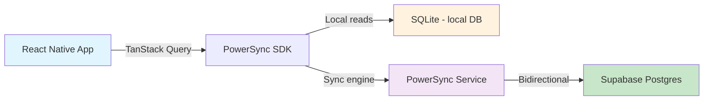
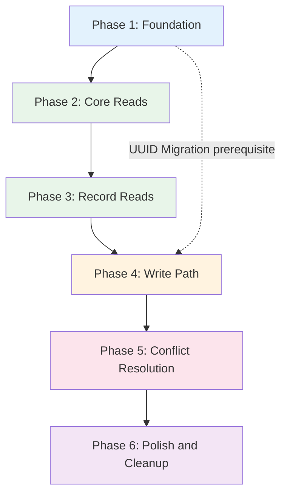

# Offline-First Implementation Plan — PowerSync + Supabase

> **VineSight React Native** · Expo SDK 54 · Phased rollout

---

## Executive Summary

This plan migrates VineSight from a purely online Supabase architecture to an **offline-first** model using [PowerSync](https://www.powersync.com/) as the local SQLite layer with bidirectional sync to Supabase. The migration is broken into **6 incremental phases**, each delivering working value without breaking existing functionality.

### Current Architecture


### Target Architecture



---

## Table Inventory

The app has **20 Supabase tables** that need sync rules. Grouped by priority:

| Priority | Tables | Rationale |
|----------|--------|-----------|
| **P0 — Core** | `farms`, `farm_seasons`, `profiles` | Required for all screens; read-heavy |
| **P1 — Records** | `irrigation_records`, `spray_records`, `fertigation_records`, `harvest_records`, `expense_records`, `daily_notes` | Primary data entry; most offline value |
| **P2 — Workers** | `workers`, `worker_attendance`, `worker_transactions`, `worker_settlements`, `work_types`, `temporary_worker_entries` | Worker management in the field |
| **P3 — Lab/Soil** | `soil_test_records`, `petiole_test_records`, `soil_profiles` | Less frequent writes |
| **P4 — Misc** | `calculation_history`, `warehouse_items` | Low-frequency, mostly append-only |

---

## Phase 1: Foundation — PowerSync SDK Setup

### Goal
Install PowerSync, configure the local SQLite database, and establish sync connectivity without changing any existing app behavior.

### Scope
- PowerSync SDK installation and configuration
- Local SQLite schema definition for all 20 tables
- PowerSync connector for Supabase auth
- Sync rules on PowerSync service
- No UI changes — existing hooks continue to use Supabase directly

### Tasks
1. Install `@powersync/react-native` and `@powersync/common` packages
2. Add required native dependencies: `react-native-quick-sqlite` or equivalent
3. Create `src/lib/powersync.ts` — PowerSync database instance and schema definition
4. Define PowerSync `Schema` with `Table` definitions matching all 20 Supabase tables
5. Create `src/lib/powersync-connector.ts` — implements `PowerSyncBackendConnector` interface
   - `fetchCredentials()` — gets JWT from Supabase auth session
   - `uploadData()` — stub that writes changes back to Supabase via REST
6. Configure PowerSync sync rules on the PowerSync dashboard/YAML for user-scoped data
7. Initialize PowerSync in `app/_layout.tsx` — wrap app with `PowerSyncContext` provider
8. Add `EXPO_PUBLIC_POWERSYNC_URL` to `.env.example`
9. Verify sync works: data flows from Supabase → local SQLite on app launch
10. Add a dev-only sync status indicator component for debugging

### Dependencies
- PowerSync account and project created
- Supabase project must have JWT secret configured for PowerSync

### Risk Level
**Medium** — Native dependency additions can cause build issues on iOS/Android. PowerSync schema must exactly match Supabase schema or sync will fail silently.

### Definition of Done
- [ ] App builds and runs on iOS and Android with PowerSync SDK
- [ ] Local SQLite database is created on first launch
- [ ] Data syncs from Supabase to local DB within 5 seconds of auth
- [ ] No existing functionality is broken — all screens still work via Supabase client
- [ ] Sync status indicator shows connected/syncing/synced states

---

## Phase 2: Read Path Migration — Core Tables

### Goal
Migrate read operations for core tables (`farms`, `farm_seasons`, `profiles`) from Supabase REST to local PowerSync SQLite queries. This makes reads instant and available offline.

### Scope
- `farms` table reads
- `farm_seasons` table reads
- `profiles` table reads
- Hooks: `useFarms`, `useFarm`, `useFarmSeasons`, `useProfile`
- Screens: Dashboard, Farms list, Farm detail, Settings

### Tasks
1. Create `src/hooks/powersync/use-powersync-farms.ts` — replaces Supabase queries with PowerSync watched queries
2. Create `src/hooks/powersync/use-powersync-farm-seasons.ts`
3. Create `src/hooks/powersync/use-powersync-profile.ts`
4. Use PowerSync `useQuery()` or `useWatchedQuery()` hooks for reactive local reads
5. Update `useFarms()` to read from PowerSync instead of Supabase
6. Update `useFarm(id)` to read from PowerSync
7. Update `useFarmSeasons()` to read from PowerSync
8. Update `useProfile()` to read from PowerSync
9. Ensure TanStack Query cache is still used for UI state management — PowerSync feeds into query data
10. Test: put device in airplane mode, verify farms list still loads from local DB
11. Add offline banner component that shows when device has no connectivity

### Dependencies
- Phase 1 complete — PowerSync SDK initialized and syncing

### Risk Level
**Medium** — Changing the read path is the most impactful change. Must ensure PowerSync query results match the shape expected by existing components. Type mismatches between SQLite column types and TypeScript interfaces are likely.

### Definition of Done
- [ ] Farms list loads instantly from local DB, no network spinner
- [ ] Farm detail screen works offline
- [ ] Profile data available offline
- [ ] Dashboard stats compute from local data
- [ ] Offline banner appears when connectivity is lost
- [ ] All existing unit tests pass

---

## Phase 3: Read Path Migration — Record Tables

### Goal
Migrate all farm record reads to PowerSync. This is the highest-value phase for field workers who need to view historical data without connectivity.

### Scope
- All record tables: `irrigation_records`, `spray_records`, `fertigation_records`, `harvest_records`, `expense_records`, `daily_notes`
- Hooks: `useIrrigationRecords`, `useSprayRecords`, `useFertigationRecords`, `useHarvestRecords`, `useExpenseRecords`, `useDailyNotes`, `useFarmRecords`
- Screens: Farm log, Activity log, Add entry form dropdowns

### Tasks
1. Create PowerSync query hooks for each record type in `src/hooks/powersync/`
2. Migrate `useIrrigationRecords()` and `useIrrigationRecordsByFarms()` to PowerSync
3. Migrate `useSprayRecords()` and `useSprayRecordsByFarms()` to PowerSync
4. Migrate `useFertigationRecords()` and `useFertigationRecordsByFarms()` to PowerSync
5. Migrate `useHarvestRecords()` and `useHarvestRecordsByFarms()` to PowerSync
6. Migrate `useExpenseRecords()` and `useExpenseRecordsByFarms()` to PowerSync
7. Migrate `useDailyNotes()` to PowerSync
8. Migrate `useFarmRecords()` composite hook to use PowerSync sub-queries
9. Handle JSON columns: `chemical_items`, `fertilizers`, `nutrient_totals_*`, `parameters` — SQLite stores these as TEXT, need JSON.parse on read
10. Handle array columns: `farm_ids` in `worker_attendance` — stored as TEXT in SQLite
11. Test all record list screens in offline mode
12. Verify season filtering still works with PowerSync SQL WHERE clauses

### Dependencies
- Phase 2 complete — core table reads migrated

### Risk Level
**Medium** — JSON column handling is the main risk. PowerSync stores JSON as TEXT in SQLite, so deserialization must be handled consistently. The `useFarmRecords` composite hook aggregates multiple record types and needs careful migration.

### Definition of Done
- [ ] All 6 record type list screens load from local DB
- [ ] Farm log timeline shows all record types offline
- [ ] Season filtering works correctly
- [ ] JSON fields like `chemical_items` and `parameters` deserialize correctly
- [ ] `useFarmRecords` composite hook returns correct aggregated data
- [ ] Performance: farm log loads in under 200ms from local DB

---

## Phase 4: Write Path — Offline Mutations

### Goal
Enable creating and updating records while offline. Changes are queued locally and synced to Supabase when connectivity returns.

### Scope
- All mutation hooks across all tables
- PowerSync upload queue implementation
- Optimistic UI updates
- Conflict detection strategy

### Tasks
1. Implement `uploadData()` in `powersync-connector.ts` — processes the PowerSync upload queue
   - Read pending changes from `CrudTransaction`
   - Map each change to the appropriate Supabase REST call: insert, update, or delete
   - Handle batch uploads efficiently
2. Create `src/lib/powersync-upload.ts` — upload logic per table with proper error handling
3. Migrate `useCreateFarm()` mutation to write to PowerSync local DB
4. Migrate `useUpdateFarm()` mutation to write to PowerSync local DB
5. Migrate `useDeleteFarm()` mutation to write to PowerSync local DB
6. Migrate all record creation mutations: irrigation, spray, fertigation, harvest, expense, daily notes
7. Migrate all record update mutations
8. Migrate all record delete mutations
9. Migrate worker mutations: create/update worker, attendance, transactions, settlements
10. Migrate warehouse item mutations
11. Migrate lab test and soil profile mutations
12. Handle UUID generation for new records — use client-side UUIDs instead of server-generated integer IDs
    - **Breaking change**: current schema uses auto-increment `id: number` — must migrate to UUID primary keys or use a temporary ID strategy
13. Add pending changes indicator in UI — show count of unsynced changes
14. Add retry logic for failed uploads with exponential backoff
15. Test: create records offline, go online, verify they appear in Supabase

### Dependencies
- Phase 3 complete — all reads migrated to PowerSync
- **Critical**: ID strategy decision — UUID vs temporary integer IDs

### Risk Level
**High** — This is the most complex phase. Key risks:
- **ID generation**: Current schema uses server-generated integer IDs. PowerSync needs client-generated IDs. This requires either migrating to UUIDs in Supabase or implementing a temporary ID mapping strategy.
- **Upload ordering**: Records with foreign keys like `farm_id` must be uploaded in dependency order.
- **Partial failures**: If a batch upload partially fails, the queue must handle retries correctly.

### Definition of Done
- [ ] Records can be created while fully offline
- [ ] Records can be updated while offline
- [ ] Records can be deleted while offline
- [ ] Changes sync to Supabase within 10 seconds of regaining connectivity
- [ ] Upload queue handles failures gracefully with retry
- [ ] Pending changes count is visible in the UI
- [ ] Foreign key relationships are maintained during upload
- [ ] No duplicate records after sync

---

## Phase 5: Conflict Resolution & Edge Cases

### Goal
Handle data conflicts when the same record is modified on multiple devices, and address edge cases like schema migrations and large datasets.

### Scope
- Conflict resolution strategy implementation
- Schema versioning for local DB
- Large dataset handling and pagination
- Error recovery flows

### Tasks
1. Define conflict resolution policy per table:
   - **Last-write-wins** for most record tables — use `updated_at` timestamp
   - **Server-wins** for `profiles` — server is source of truth
   - **Merge** for `worker_attendance` — combine attendance records from different devices
2. Implement conflict detection in `uploadData()` — check for 409 or version mismatch errors
3. Add `updated_at` trigger on Supabase for all tables that lack it
4. Implement local schema migration strategy — handle PowerSync schema changes between app versions
5. Add data integrity checks — verify foreign key consistency in local DB
6. Handle the case where a farm is deleted on server while records are being created offline for that farm
7. Implement sync error logging and reporting — surface sync failures to the user
8. Add a manual sync trigger button in Settings
9. Handle large initial sync — progressive loading with sync progress indicator
10. Test multi-device conflict scenarios
11. Add sync conflict resolution UI — show conflicts and let user choose resolution when automatic resolution is insufficient

### Dependencies
- Phase 4 complete — write path working

### Risk Level
**High** — Conflict resolution is inherently complex. The current schema lacks `updated_at` on several tables like `irrigation_records`, `spray_records`, etc., which makes last-write-wins harder to implement. Multi-device testing requires careful coordination.

### Definition of Done
- [ ] Two devices editing the same record results in deterministic resolution
- [ ] Deleted-on-server records are handled gracefully on the client
- [ ] Schema migrations work when updating the app
- [ ] Sync errors are logged and surfaced to the user
- [ ] Manual sync trigger works from Settings
- [ ] Initial sync of 1000+ records completes without timeout
- [ ] No data loss in any tested conflict scenario

---

## Phase 6: Polish, Performance & Cleanup

### Goal
Remove the old Supabase direct-query code paths, optimize performance, add comprehensive monitoring, and ensure production readiness.

### Scope
- Remove legacy Supabase query code
- Performance optimization
- Monitoring and observability
- Documentation

### Tasks
1. Remove all direct `supabase.from().select()` calls from hooks — PowerSync is now the only read path
2. Remove `getUserId()` helper functions from individual hooks — PowerSync handles auth scoping via sync rules
3. Simplify TanStack Query usage — PowerSync watched queries may replace some React Query patterns
4. Add PowerSync sync metrics to telemetry: sync duration, queue depth, error rates
5. Optimize SQLite indexes for common query patterns: `farm_id`, `date`, `season_id`
6. Add data export/import capability for backup
7. Implement selective sync — allow users to choose which farms sync offline for storage optimization
8. Add storage usage indicator in Settings — show local DB size
9. Write integration tests for offline scenarios
10. Update `AGENTS.md` with new architecture documentation
11. Update `README.md` with offline-first setup instructions
12. Create runbook for PowerSync operational issues

### Dependencies
- Phase 5 complete — conflict resolution working

### Risk Level
**Low** — This is cleanup and optimization. The core functionality is already working. Main risk is accidentally removing code that is still needed.

### Definition of Done
- [ ] No direct Supabase REST queries remain in hooks — all reads go through PowerSync
- [ ] App works fully offline for all CRUD operations
- [ ] Sync metrics are visible in telemetry dashboard
- [ ] Local DB size is under 50MB for typical usage of 5 farms
- [ ] All tests pass including new offline integration tests
- [ ] Documentation is updated
- [ ] Performance: all screens load in under 300ms from local DB

---

## Cross-Cutting Concerns

### ID Strategy Decision — Required Before Phase 4

The current schema uses **auto-increment integer IDs** from Postgres. PowerSync requires **client-generated IDs** for offline writes. Options:

| Option | Pros | Cons |
|--------|------|------|
| **Migrate to UUIDs** | Clean, standard approach; no ID conflicts | Requires Supabase migration; breaks existing foreign keys |
| **Client-side UUID with server mapping** | No schema change needed | Complex mapping logic; two ID systems |
| **Use PowerSync temporary IDs** | Built-in PowerSync feature | Must handle ID replacement after sync |

**Recommendation**: Migrate to UUIDs in Supabase as a pre-requisite before Phase 4. This is a one-time migration that simplifies all future offline work.

### Sync Rules Architecture

PowerSync sync rules must scope data to the authenticated user:

```yaml
# Conceptual sync rules
bucket_definitions:
  user_data:
    parameters: SELECT token_parameters.user_id as user_id
    data:
      - SELECT * FROM farms WHERE user_id = bucket.user_id
      - SELECT * FROM farm_seasons WHERE user_id = bucket.user_id
      - SELECT * FROM irrigation_records WHERE farm_id IN SELECT id FROM farms WHERE user_id = bucket.user_id
      # ... similar for all record tables
```

### Testing Strategy

Each phase should include:
- **Unit tests**: Mock PowerSync queries, verify data transformations
- **Integration tests**: Test sync flow with a real PowerSync instance
- **Offline simulation tests**: Use airplane mode or network conditioner
- **Multi-device tests**: Phase 5+ requires testing concurrent edits

---

## Phase Dependency Graph



---

## Risk Summary

| Phase | Risk | Mitigation |
|-------|------|------------|
| 1 | Native build failures | Test on both platforms early; pin dependency versions |
| 2 | Type mismatches SQLite vs TS | Create type-safe query wrappers with runtime validation |
| 3 | JSON column deserialization | Centralize JSON parsing in a utility layer |
| 4 | ID generation conflicts | Migrate to UUIDs before starting Phase 4 |
| 4 | Upload ordering with FK deps | Implement dependency-aware upload queue |
| 5 | Data loss from conflicts | Default to server-wins; log all conflicts for audit |
| 6 | Removing still-needed code | Feature flags to gradually disable old paths |
