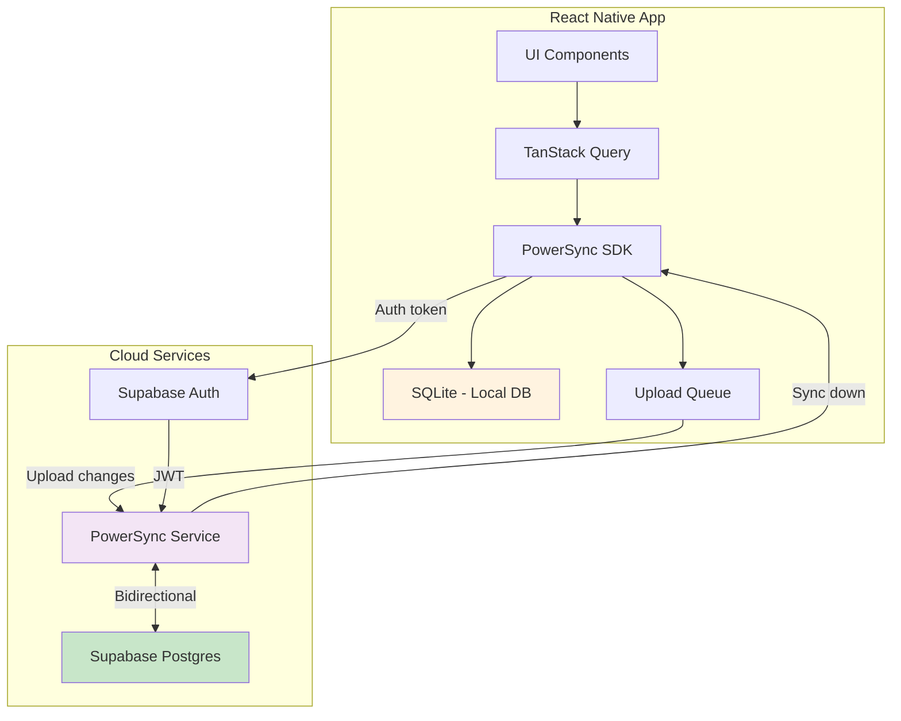

# Offline-First Architecture — PowerSync + Supabase

> **VineSight React Native** · Architecture Decision Record

---

## Context

VineSight is a vineyard management app used by farmers and consultants in the field, where cellular connectivity is often unreliable or absent. The current architecture requires an active internet connection for all data operations, making the app unusable in low-connectivity environments.

## Decision

Adopt **PowerSync** as the offline-first sync layer between the React Native client and Supabase backend.

## Architecture Overview

## Data Flow

### Reads — Local First
1. UI component renders and triggers a TanStack Query hook
2. Hook calls PowerSync `useQuery()` or `useWatchedQuery()`
3. PowerSync reads from local SQLite — **instant, no network required**
4. PowerSync sync engine keeps local DB updated in the background when online

### Writes — Queue and Sync
1. User creates/updates/deletes a record
2. Mutation writes to local SQLite via PowerSync
3. Change is added to the PowerSync upload queue
4. When online, `uploadData()` in the connector processes the queue
5. Each change is sent to Supabase via REST API
6. PowerSync service syncs the confirmed change back down

### Conflict Resolution
- **Default**: Last-write-wins using `updated_at` timestamps
- **Profiles**: Server-wins — server is authoritative
- **Deletes**: Soft-delete pattern where possible to avoid data loss

## Key Components

| Component | Location | Purpose |
|-----------|----------|---------|
| PowerSync instance | `src/lib/powersync.ts` | Database and schema definition |
| Supabase connector | `src/lib/powersync-connector.ts` | Auth and upload logic |
| PowerSync provider | `app/_layout.tsx` | React context for PowerSync |
| Sync status store | `src/stores/sync-store.ts` | Zustand store for sync state |
| Offline banner | `src/components/ui/offline-banner.tsx` | UI indicator for connectivity |

## Schema Mapping

PowerSync uses SQLite locally. Key differences from Postgres:

| Postgres Type | SQLite Type | Handling |
|---------------|-------------|----------|
| `integer` / `bigint` | `INTEGER` | Direct mapping |
| `text` / `varchar` | `TEXT` | Direct mapping |
| `numeric` / `real` | `REAL` | Direct mapping |
| `boolean` | `INTEGER` | 0/1 mapping |
| `jsonb` | `TEXT` | JSON.parse/stringify |
| `integer[]` | `TEXT` | JSON array as string |
| `timestamptz` | `TEXT` | ISO 8601 string |
| `uuid` | `TEXT` | String representation |

## Sync Rules

Data is scoped per user using PowerSync bucket definitions:

- Each user gets a single bucket containing all their data
- Farms are filtered by `user_id`
- Records are filtered by `farm_id` which belongs to the user
- Workers and warehouse items are filtered by `user_id`

## Security

- PowerSync authenticates using Supabase JWT tokens
- Row-level security in Supabase remains active for direct API calls
- Sync rules in PowerSync enforce the same access patterns as RLS
- Local SQLite data is stored in the app sandbox — protected by OS-level security

## Trade-offs

| Benefit | Cost |
|---------|------|
| Instant reads from local DB | Additional SDK dependency and complexity |
| Full offline CRUD capability | Must handle conflict resolution |
| Reduced Supabase API calls | PowerSync service cost |
| Better UX in low-connectivity | Local storage usage on device |
| Reactive queries via watched queries | Migration effort for existing hooks |

## References

- [PowerSync React Native SDK](https://docs.powersync.com/client-sdk-references/react-native)
- [PowerSync + Supabase Integration](https://docs.powersync.com/integration-guides/supabase)
- [Implementation Phases](./offline-first-phases.md)
